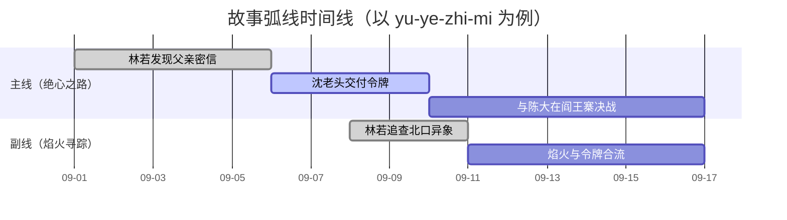
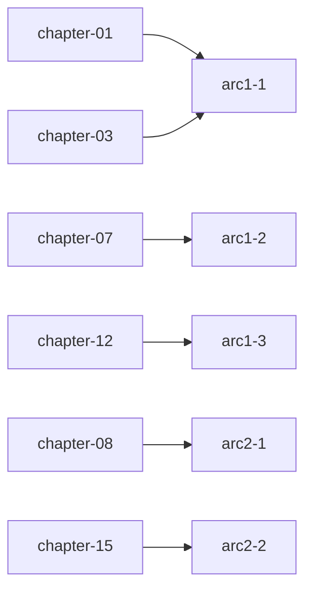

<!--
Skill metadata fields above are documentation-only. See:
  ../common/project-conventions.md        跨 skill 通用约定
  ../common/cli-priority.md               CLI 调用优先级
  ../common/cross-reference-rules.md      跨实体引用 9 类规则
  ../common/id-naming.md                  kebab-case / CJK 音译 / 命名规则
-->

# 情节结构

## 这个 skill 做什么

规划和管理情节弧、情节点、伏笔和叙事时间线。每条弧是 `plot/arcs/` 下的一篇 markdown 文件，所有弧的合并时间线放在 `plot/timeline.md`。plot index 追踪所有弧的状态和主题覆盖。

## 工作流（checklist）

```
□ 1. 读 story.md 拿主题 + plot/_index.md + characters/_index.md
□ 2. 选故事结构（用 decision table，见下文）
□ 3. 创建弧（按 4 步访谈）
□ 4. 加情节点 / 时间线事件
□ 5. 伏笔追踪（必要时升级到 continuity/promises/）
□ 6. CLI 跑 validate + reindex + links
```

## 前置条件

项目根目录得有 `story.md`（由 `story-init` 创建）。先确认存在。

## 选择故事结构（决策表）

| 故事特征 | 推荐结构 |
| --- | --- |
| 标准长篇、读者预期清晰、商业类型 | **三幕结构** |
| 主角有明确内在蜕变（成长、救赎、复仇→放下） | **英雄之旅** |
| 节奏紧、卖点鲜明、读者买账的是"过程爽感" | **救猫咪** |
| 日常生活 / 主题探索 / 不依赖冲突 | **起承转合** |
| 多视角、多线索、政治剧、史诗 | **五幕结构** |
| 爱情线为主 / 浪漫类型 | 七点结构 + 爱情节拍 |
| 短篇 / 试验性 / 不预设大纲 | 自由写作（写后回填结构） |

详细节拍清单见 `references/structure-models.md`。三幕结构是默认兜底；非这个结构时**先跟用户确认**，别替他选。

## 创建弧

1. 读 `story.md` 拿主题
2. 读 `plot/_index.md` 了解现有弧
3. 读 `characters/_index.md` 看现有可用角色
4. 跟用户确认：
   - 弧的名字
   - 类型（`main` / `subplot` / `character` / `thematic`）
   - 涉及哪些角色
   - 服务哪些主题
5. 用对话把弧聊出来：setup → escalation → climax → resolution
6. 按 `references/arc-template.md` 写文件
7. 存到 `plot/arcs/{arc-name-kebab}.md`
8. 更新 `plot/_index.md` 的 Arcs 表
9. 更新 `plot/_index.md` 的主题追踪节
10. 如果引用了角色，**核实他们在 `characters/` 里存在**
11. CLI 可用就跑 `story reindex .`、`story links .`、`story validate .`

## 管理情节点

情节点写在弧文件的 Plot Points 表里。加情节点时：

1. 读对应弧的文件
2. 在表里添加该情节点，带上章节引用（**先验证章节文件存在**，再写章节 id）
3. 按时间顺序把事件加到 `plot/timeline.md`
4. 如果情节点带伏笔，加进弧的 foreshadowing 表
5. 如果情节点形成读者承诺或悬念，创建或更新 `continuity/promises/` 或 `continuity/questions/` 里的一条记录（见下方升档规则）
6. CLI 可用就跑 `story validate .`

## 时间线管理

`plot/timeline.md` 是跨所有弧的全故事事件总时间线。

加事件时：

- 按时间顺序插入
- 链接到对应的弧和章节
- 每条事件一行，简短扼要

复核时间线时用这些量化规则找"节奏问题"：

| 现象 | 触发条件 | 含义 |
| --- | --- | --- |
| 太紧凑 | 同弧相邻两个情节点跨 ≤ 1 章 | 节奏密集，需要松一口气 |
| 太飘移 | 同弧沉默 ≥ 5 章无任何情节点 | 读起来像忘了这条弧 |
| 顺序错 | 同一章出现两条弧的事件，但本应是 A 先 B 后 | 可能是重排章节导致 |
| 时间错 | "三天后"出现在相隔 1 章内 | 钟点 / 日期有矛盾 |

## 伏笔追踪

每条弧在自己的 Foreshadowing 表里追踪伏笔：

- **Planted** —— 埋下了什么暗示或铺垫
- **Payoff** —— 怎么兑现
- **Chapter Planted / Chapter Payoff** —— 各在哪一章
- **Status** —— `planned` / `planted` / `paid-off`

写章节时，把状态还是 `planted`、但还没兑现的条目挑出来当提醒。

### 伏笔升档到 Promise 的决策

满足下列**任一条件**时，把弧内伏笔升级到独立 `continuity/promises/<id>.md`：

1. **跨 ≥ 2 条弧** —— 不同弧线都要兑现这个承诺
2. **跨度 ≥ 5 章** —— 长程兑现，短期在弧内追踪会丢失
3. **会在 ≥ 1 个分支结局里被改写** —— 结局多样，需要独立追踪

升档前先在两个弧文件里去掉对应伏笔条目，加一行 `moved-to-promise: <promise-id>` 链接。

跨弧的长效伏笔承诺追踪，统一维护在 `continuity/promises/{promise-kebab}.md`，字段：`status`、`planted`、`payoff`、`arcs`、`characters`。悬念或开放连续性的追踪放在 `continuity/questions/{question-kebab}.md`。


## 可视化（用户触发了"画"类词时）

当用户说"画时间线"/"画弧线"/"画章节进度"时，落档到 `plot/_index.md` 末尾。

**弧线甘特图示例**：



**章节-弧线映射示例**：



注意：
- 仅在用户说了"画"/"图"/"可视化"之后才输出
- 引用的 `arc-{N}` / `chapter-{NN}` 必须已经在项目里存在
- `gantt` 适合画时间线，`flowchart` 适合画关联
- 渲染约定详见 `../common/mermaid-output.md`
## CLI 维护

> CLI 三种调用方式的优先级与失败处理统一见 `../common/cli-priority.md`。

CLI 完全不可用时，手工做注册表和反向链接检查。

## 跨实体引用

> 9 类双向引用规则见 `../common/cross-reference-rules.md`。
>
> 本 skill 主要涉及的：弧↔角色（arcs-advanced）、弧↔章节（情节点章节引用）、承诺↔章节 / 弧 / 角色（planted/payoff/arcs/characters）。

## 参考文件

- **`references/arc-template.md`** —— 弧文件模板（frontmatter + 各节）
- **`references/question-template.md`** —— 连续性问题 / 悬念模板
- **`references/promise-template.md`** —— setup / payoff 追踪模板
- **`references/structure-models.md`** —— 故事结构模型（三幕、英雄之旅、Save the Cat、起承转合、五幕）以及对应的 beat sheet
- **`../common/project-conventions.md`** —— 跨 skill 命名 / schema / 权限约定
- **`../common/id-naming.md`** —— kebab-case / CJK 音译规则
- **`../common/cross-reference-rules.md`** —— 9 类双向引用规则