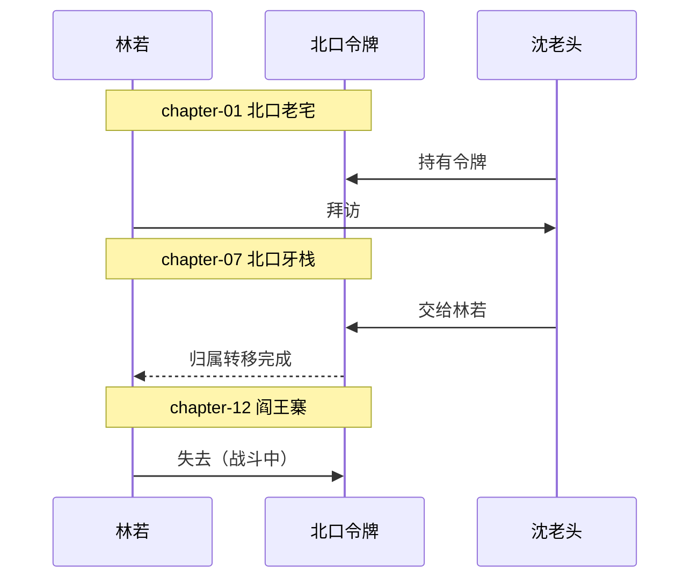

<!--
Skill metadata fields above are documentation-only. See:
  ../common/project-conventions.md        跨 skill 通用约定
  ../common/cli-priority.md               CLI 调用优先级
  ../common/continuity-audit-checklist.md 连续性审计 10 项 + CLI 自动覆盖项
  ../common/cross-reference-rules.md      跨实体引用 9 类规则
  ../common/id-naming.md                  kebab-case / CJK 音译 / 命名规则
  ../common/mermaid-output.md             可视化约定
-->

# 修订与连续性

## 这个 skill 做什么

在 Story Skills 项目上做修订，不掉连续性。本 skill 管定向章节编辑、连续性审计、发展性修订、行编辑，以及起草下一章前的 pre-flight。

## 工作流（checklist）

```
□ 0. 明确修订类型（见 4 类对比表）—— 除非用户已指定
□ 1. 写一份简短修订计划（references/revision-plan-template.md）
□ 2. 读相关上下文（按 ../common/continuity-audit-checklist.md L1/L2/L3 分层）
□ 3. 跑 story continuity . 收集确定性结论
□ 4. 在 markdown 文件里做定向编辑（不要写本地脚本改正文）
□ 5. 同步元数据（章节 status、word-count、scene status、continuity/state.md、promise/question 状态、角色/地点档案）
□ 6. CLI 跑 wordcount --write + reindex + links + validate + continuity + doctor
□ 7. 按报告模式或修订模式输出
```

## 前置条件

故事项目必须存在。先确认项目根目录有 `story.md`，CLI 可用时跑一下 `story report .` 看看当前状况。

## 4 类修订对比表（用户没指定时用这张选）

| 类型 | 改的是 | 不动 | 例 | 何时用 |
| --- | --- | --- | --- | --- |
| **连续性审计** | 元数据 + 引用 + 连续性档案 | 正文 | 时间线漏了一章 / 已故角色还在 `characters` | 用户说"找矛盾" / "检查连续性" |
| **发展性修订** | 结构 + 弧推进 + 场景目的 | 词句 | 中段松懈 / 节奏拖沓 / 弧推进飘移 | 用户说"打磨草稿" / "发展性编辑" |
| **行编辑** | 词句 + 节奏 + 感官具体性 | 情节事实 | 简化一段 / 加感官细节 / 改对话声音 | 用户说"行编辑" / "改一段" |
| **校对 / 打磨** | 字词 + 语法 + 格式 | 一切 | 错别字 / 重复 / 格式不一致 | 用户说"校对" / 最后一遍 |

## 1. 写修订计划

除非用户明确"小改一下"，否则先写一份简短的修订计划（4 行结构），模板见 `references/revision-plan-template.md`：

```markdown
## 修订计划

- 改什么：{改哪一章 / 哪几段 / 哪些档案}
- 为了连续性必须保留什么：{已兑现的伏笔 / 不可改的角色状态 / 已映射的时间线章节}
- 顺带动哪些文件：{相关角色档案 / 弧文件 / scene 状态}
- 完工验证命令：story continuity . && story doctor . && story validate .
```

## 2. 读相关上下文

按 `../common/continuity-audit-checklist.md` 的分层读取原则加载，避免长档案一遍通读：

- `story.md`
- `chapters/_index.md`
- 目标章节文件
- 存在时，前后章节
- 章节 frontmatter 引用的角色、地点、系统、弧文件
- 对应的 `scenes/` 场景文件
- `continuity/state.md`、悬念记录、伏笔承诺
- 对连续性敏感的修订，还要看 `plot/timeline.md` 和进行中的弧文件

## 3. 同步依赖元数据

- 章节 frontmatter `status`（`draft` → `revised`，只在合适的时候 `revised` → `final`）
- CLI 可用时通过 CLI 写章节 `word-count`
- 事件变了就改 `plot/timeline.md`
- POV、地点、参与者、状态变化移动了，就改 `scenes/` 记录
- 知识、物件归属、悬念状态、payoff 变了，就改 `continuity/state.md`、`continuity/questions/` 或 `continuity/promises/`
- 修订改了 setup / payoff，弧的情节点或伏笔状态也要跟着改
- 角色或地点的状态、关系、地点引用变了，文件也要同步

## 4. 直接在 markdown 文件里做定向编辑

不要写项目本地的脚本去重写正文。

修订时把"自动改"和"问用户再改"分开：

| 类型 | 操作 |
| --- | --- |
| 状态字段（`status`, `died-in`, word-count, scene `state-changes`） | 直接改 |
| 双向引用联动（另一边的反向引用） | 直接改，附通知 |
| 章节正文（增删段落、整段重写） | 改前贴出 diff 让用户看，除非他已批 |
| 角色档案正文改动 | 改前贴出 diff 让用户看 |

## 5. 跑维护

```shell
story wordcount . --write
story reindex .
story links .
story validate .
story continuity .
story doctor .
```

`story continuity` 自动覆盖的检查：`died-in` vs 后续出场、承诺/悬念章节顺序、未兑现的伏笔、POV/角色一致性、`continuity/state.md` 引用。**故意做的**闪回、回忆、死者录音，放在章节或场景的 `mentions` 而不是 `characters` 里。

详细见 `../common/continuity-audit-checklist.md` 的"`story continuity` 自动覆盖"段。

## 可视化（用户触发了"画"类词时）

当用户问"画时间线" / "画章节进度" / "画连续性图"时，落档到 `continuity/state.md` 末尾：



注意：仅在用户说了"画"/"图"/"可视化"之后才输出 mermaid 块，默认文字描述。Mermaid 输出约定见 `../common/mermaid-output.md`。

## 报告输出

**用户要审计 →** 按严重度（critical / major / minor）给出发现，带上文件引用和具体改法。不要直接动手改。

**用户要修订 →** 把改过的文件、改过的连续性事实、维护命令的运行结果汇报一下。

## CLI 维护

> CLI 三种调用方式的优先级与失败处理统一见 `../common/cli-priority.md`。

## 跨实体引用

> 9 类双向引用规则见 `../common/cross-reference-rules.md`。

## 参考文件

- **`references/revision-plan-template.md`** —— 4 行修订计划模板
- **`../common/continuity-audit-checklist.md`** —— 连续性审计 10 项 + CLI 自动覆盖项
- **`../common/project-conventions.md`** —— 跨 skill 通用约定
- **`../common/id-naming.md`** —— kebab-case / CJK 音译规则
- **`../common/cross-reference-rules.md`** —— 9 类双向引用规则
- **`../common/mermaid-output.md`** —— 可视化触发约定