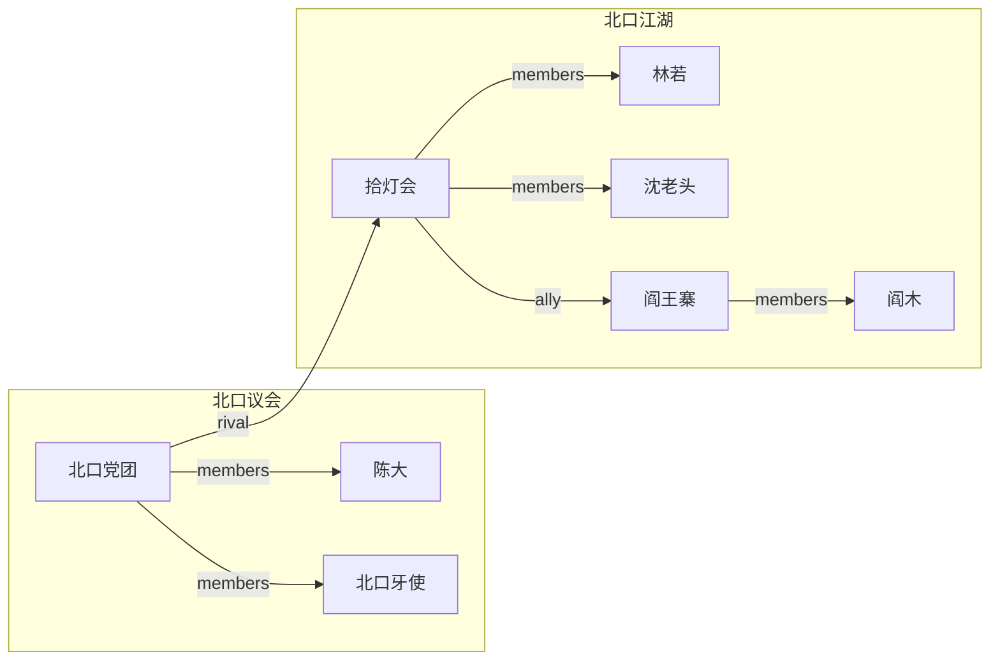
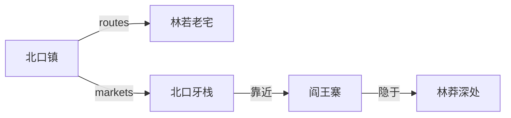

<!--
Skill metadata fields above are documentation-only. See:
  ../common/project-conventions.md        跨 skill 通用约定
  ../common/cli-priority.md               CLI 调用优先级
  ../common/cross-reference-rules.md      跨实体引用 9 类规则
  ../common/id-naming.md                  kebab-case / CJK 音译 / 命名规则
-->

# 世界观构建

## 这个 skill 做什么

围绕故事项目搭建和管理世界观元素：地点、系统（魔法 / 政治 / 科技 等）、阵营、器物。统一以 markdown 文件落在 `worldbuilding/` 目录，带 YAML frontmatter，所有元素与角色和其他故事元素互相引用。

## 工作流（checklist）

```
□ 1. 读 story.md 拿类型 / 时代 / 腔调 + 当前 _index.md
□ 2. 选体系类型（用 references/world-element-types.md 决定）
□ 3. 系统 vs 阵营边界判定（见下文边界规则）
□ 4. 访谈 / 模板落档
□ 5. 双向引用同步（见 ../common/cross-reference-rules.md）
□ 6. CLI 跑 reindex + links + validate
```

## 前置条件

项目根目录得有 `story.md`（由 `story-init` 创建）。确认存在再开始。

## 系统 vs 阵营 边界

| 走 `worldbuilding/systems/` | 走 `worldbuilding/factions/` |
| --- | --- |
| **制度 / 抽象机制 / 跨组织的力量** | **有成员的具体组织** |
| 例：北口政治体系、魔法体系、税收制度 | 例：北口议会党团、沈家护卫队、拾灯会 |
| 字段：`type`（magic/political/tech/religion/economic/military/social/education） | 字段：`type`（family/guild/government/military/religion/company/community/criminal/other） |
| 引用角色靠 tags | 引用角色靠 `members` 字段 |

> 同一对相关概念可以并存："魔法体系"（system）+ "魔法学院"（faction）。两者写不同文件。

## 创建地点

1. 读 `story.md`，拿类型、时代、腔调这些背景
2. 读 `worldbuilding/_index.md`，看现有的地点和系统
3. 问用户地点的名字和类型（城市、堡垒、荒野 等）
4. 用对话把地点聊出来，覆盖：
   - 物理描写和氛围
   - 与故事相关的历史
   - 居民的风俗和文化
   - 角色会互动的显著特征
   - 当前时间线上的状态
5. 按 `references/location-template.md` 模板写文件
6. 存到 `worldbuilding/locations/{name-kebab}.md`
7. 更新 `worldbuilding/_index.md` 的 Locations 表
8. 如果列出了 notable-characters，**核实对应角色文件存在**，并把该地点的 kebab-case 标识加到每个角色文件的 `locations` frontmatter 列表里（双向）
9. CLI 可用就跑 `story reindex .`、`story links .`、`story validate .`

## 创建系统

1. 读 `story.md`，拿类型和主题信息
2. 读 `worldbuilding/_index.md`，看现有系统
3. 判断系统类型，翻 `references/world-element-types.md` 找对应类型的提示清单
4. 按那个清单通过对话聊系统
5. 按 `references/system-template.md` 写文件
6. 存到 `worldbuilding/systems/{name-kebab}.md`
7. 更新 `worldbuilding/_index.md` 的 Systems 表
8. 与跟系统互动的角色建立交叉引用（用 `tags` 字段，比如魔法系统 → `magic-user`）
9. CLI 可用就跑 `story reindex .`、`story links .`、`story validate .`

> tag 复用约束：项目内同一类标签用同一个字符串。**绝不同义混用**（`magic-user` 与 `mage` 与 `术士` 三选一）。详见 `../common/cross-reference-rules.md`。

## 创建阵营

CLI 可用就用：

```shell
story add faction "{Faction Name}" --type "{family|guild|government|military|religion|company|community|criminal|other}"
```

否则手动创建 `worldbuilding/factions/{name-kebab}.md`，frontmatter 字段：`name`、`type`、`status`、`members`、`locations`、`tags`。

需要覆盖：

- 目的和意识形态
- 权力基础、地盘、资源
- 重要成员（写入 `members`，每个角色都要在自己的角色文件里反向引用）
- 冲突和施压点

## 创建器物

CLI 可用就用：

```shell
story add artifact "{Artifact Name}" --type "{object|weapon|document|technology|relic|symbol|resource|other}"
```

否则手动创建 `worldbuilding/artifacts/{artifact-kebab}.md`，frontmatter 字段：`name`、`type`、`status`、`owner`、`location`、`tags`。

需要覆盖：

- 外观描述和辨识要点
- 功能、约束和代价（**必填**：任何道具都要有硬约束，否则会被滥用破剧情）
- 历史和过往持有者
- 当前持有者 / 所在地的状态（`owner` 字段填角色或阵营 id）

## 更新世界元素（常见重命名 / 拆分 / 退场）

1. **重命名地点 / 阵营 / 器物**：用 `story rename <kind> <old-id> "<new-name>"` —— 不要直接改文件名和内容，会断反向引用。
2. **拆分一个地点为多个**（例：旧"北口"拆为"内城"+"外城"）：先建新文件，再迁移正文段落，最后用 `story rename` 保留旧 id 指向新 id 作为 alias。
3. **地点 / 阵营 / 器物退场**：保留文件但把 `status` 改 `defunct`/`archived`；不要删除——历史章节可能还引用它。
4. **一般属性微调**：读现有文件 → 按需求改 → 改反向链接（`../common/cross-reference-rules.md`）→ 跑 `story reindex .`、`story links .`、`story validate .`。


## 可视化（用户触发了"画"类词时）

当用户说"画地点网络"/"画阵营图"/"世界地图"时，落档到 `worldbuilding/_index.md` 末尾。

**阵营成员图示例**：



**地点网络示例**：



注意：
- 仅在用户说了"画"/"图"/"可视化"之后才输出
- 引用的 id 必须已经在 `worldbuilding/locations/*.md` 或 `factions/*.md` 存在
- 默认仍用文字描述，Mermaid 是可选输出
- 渲染约定详见 `../common/mermaid-output.md`
## CLI 维护

> CLI 三种调用方式的优先级与失败处理统一见 `../common/cli-priority.md`。

CLI 完全不可用时，手工做注册表和反向链接检查。

## 跨实体引用

> 9 类双向引用规则见 `../common/cross-reference-rules.md`。
>
> 本目录主要涉及的：地点↔角色（`notable-characters`↔`locations`）、阵营↔角色（`members`↔角色 tags）、器物↔持有者（`owner`↔角色 tags）、器物↔地点（`location`↔地点引用）。

## 参考文件

- **`references/location-template.md`** —— 地点文件模板
- **`references/system-template.md`** —— 系统文件模板
- **`references/faction-template.md`** —— 阵营文件模板
- **`references/artifact-template.md`** —— 器物 / 物件文件模板
- **`references/world-element-types.md`** —— 每种系统类型（魔法、政治、科技、宗教、经济、军事、社会、教育）的详细提示清单
- **`../common/project-conventions.md`** —— 跨 skill 命名 / schema / 权限约定
- **`../common/id-naming.md`** —— kebab-case / CJK 音译规则
- **`../common/cross-reference-rules.md`** —— 9 类双向引用规则